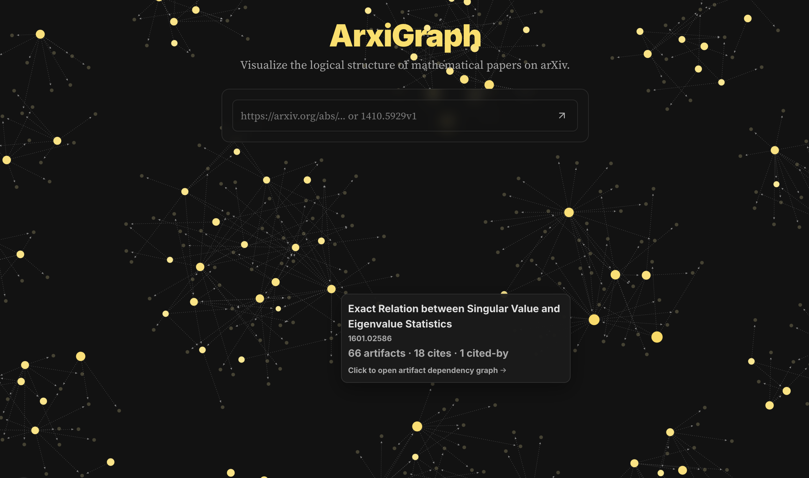
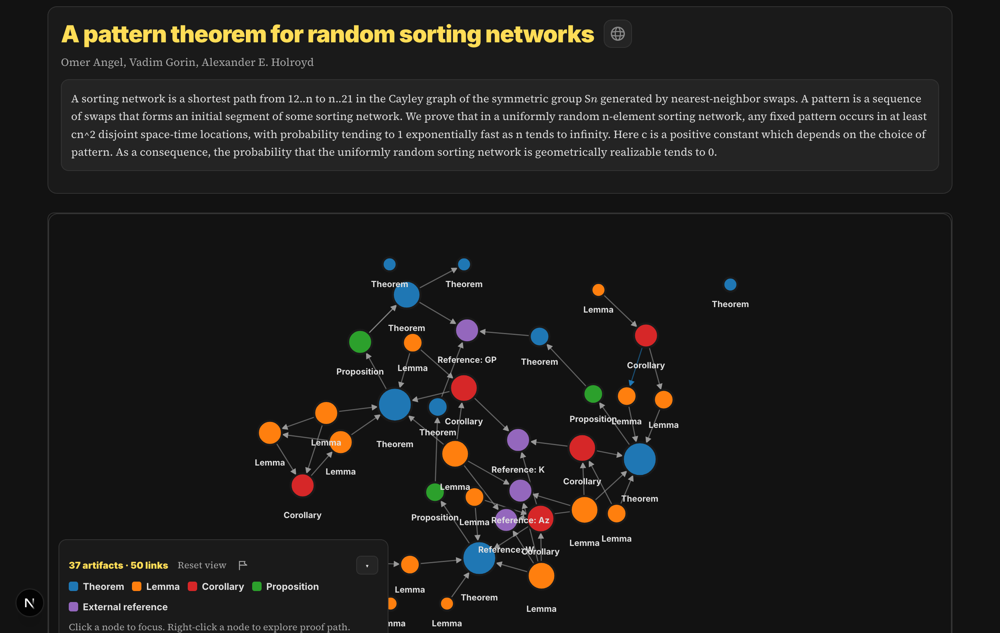

# ArxiGraph

ArxiGraph is the **web UI** for exploring [ArxiTex](https://github.com/dsleo/arxitex/tree/main) outputs (document graphs + definition banks) and for running the ArxiTex extraction pipeline via a local backend.



## What this app does

- Browse paper graphs exported to JSON (e.g. from a Hugging Face dataset) and visualize artifacts + dependencies.
- Call the ArxiTex **FastAPI backend** to process a paper on-demand and stream results to the UI.




## Local development

### 1) Start the Python backend of [ArxiTex](https://github.com/dsleo/arxitex/tree/main)

```bash
python -m venv .venv
source .venv/bin/activate
pip install -r requirements.txt
pip install -e .

uvicorn arxitex.server.app:app --reload --port 8000
```

> Note: if you enable enhancements (dependency inference / definition enrichment), the backend requires `OPENAI_API_KEY`.

### 2) Configure ArxiGraph env vars

Copy the example and edit it:

```bash
cd arxigraph
cp .env.local.example .env.local
```

Minimum required variable:

- `NEXT_PUBLIC_ARXITEX_BACKEND_URL` (defaults to `http://127.0.0.1:8000`)

Optional variables:

- `NEXT_PUBLIC_HF_DATASET_ORG`, `NEXT_PUBLIC_HF_DATASET_REPO`, `NEXT_PUBLIC_HF_DATASET_REF` for loading paper exports from a Hugging Face dataset.
- `SUPABASE_URL`, `SUPABASE_SERVICE_ROLE_KEY`, `GRAPH_FEEDBACK_IP_SALT` if you enable feedback ingestion.

### 3) Run the Next.js dev server

```bash
cd arxigraph
npm ci
npm run dev
```

Then open:

```
http://localhost:3000
```

## Build

```bash
cd arxigraph
npm run build
npm run start
```
